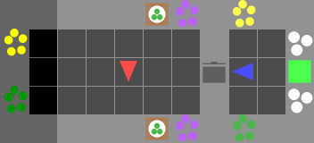
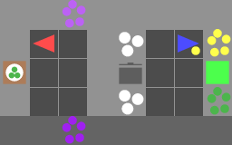
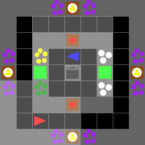

# Overcooked-V2 Experiments

이 저장소는 [Overcooked-V2] 환경에서 Zero-Shot Coordination (ZSC)을 위한 다양한 기준 모델(baselines)을 구현하고, 추가적인 연구를 진행하기 위해 만들어졌습니다. JAX 기반으로 구현된 [overcooked-v2/experiments] (https://github.com/overcookedv2/experiments)를 참고했습니다.

## 설치 (Installation)

```bash
# 1. Conda 가상환경 생성 및 활성화
conda create -n overcooked_v2 python=3.10
conda activate overcooked_v2

# 2. 의존성 패키지 설치
pip install -e JaxMARL
pip install -e experiments
```

## 환경 (Environments)

이 저장소에서는 다양한 Overcooked-V2 레이아웃을 사용하여 실험을 진행합니다. 주요 환경은 다음과 같습니다.

### Simple Layouts

| `grounded_coord_simple` | `demo_cook_simple` | `test_time_simple`
| :---: | :---: | :---: |
|  |  |  |

### Hard Layouts

| `grounded_coord_ring` | `demo_cook_wide` | `test_time_wide` |
| :---: | :---: | :---: |
|  |  |  |

<br/>

## 실험 실행 (Running Experiments)

실험은 `overcooked_v2_experiments/ppo/main.py`를 통해 실행하며, Hydra를 사용하여 설정을 관리합니다.

| 실험 종류 | 설명 | 실행 명령어 예시 |
| :--- | :--- | :--- |
| **SP** (Self-Play) | 에이전트가 자기 자신과 플레이하며 학습합니다. 가장 기본적인 훈련 방식입니다. | `python overcooked_v2_experiments/ppo/main.py +experiment=rnn-sp +env=grounded_coord_simple NUM_SEEDS=10` |
| **SA** (State-Augmentation) | 다른 에이전트의 잠재적 행동을 상태에 추가하여 학습합니다. | `python overcooked_v2_experiments/ppo/main.py +experiment=rnn-sa +env=grounded_coord_simple NUM_SEEDS=10 NUM_ITERATIONS=10` |
| **OP** (Other-Play) | 미리 훈련된 다양한 에이전트(population)와 무작위로 매칭되어 학습합니다. | `python overcooked_v2_experiments/ppo/main.py +experiment=rnn-op +env=grounded_coord_simple NUM_SEEDS=10` |
| **FCP** (Fictitious Co-Play) | SP로 학습된 에이전트 집단(population) 내에서 파트너를 선택하여 학습합니다. | `python overcooked_v2_experiments/ppo/main.py +experiment=rnn-fcp +env=grounded_coord_simple NUM_SEEDS=1 +FCP=<population_path>` |
| **E3T** (Environment-Ego-Teammate) | 파트너의 행동을 예측하는 모듈을 추가하여, 예측된 정보를 정책 입력으로 활용합니다. | `python overcooked_v2_experiments/ppo/main.py +experiment=rnn-e3t +env=grounded_coord_simple NUM_SEEDS=10` |

- `+experiment`: `rnn-sp`, `rnn-sa`, `rnn-op`, `rnn-fcp`, `rnn-e3t` 등 실험 유형을 지정합니다.
- `+env`: `grounded_coord_simple` 등 환경 레이아웃을 지정합니다.
- `NUM_SEEDS`: 동시에 실행할 시드 수를 설정합니다.

### E3T & STL 실험 (Partner Modeling)

이 저장소는 파트너 모델링을 위한 최신 알고리즘인 E3T와 STL을 지원합니다.

#### 1. E3T (Environment-Ego-Teammate)
E3T는 **Stateless Prediction** 방식을 사용하여 파트너를 모델링합니다.
- **작동 원리**: 매 스텝 최근 5개의 관측(`obs_history`)과 파트너 행동(`act_history`)을 입력받아 파트너의 다음 행동을 예측합니다.
- **특징**: 과거의 잠재 상태(Latent State)를 유지하지 않고 현재의 기록(History)에만 의존하므로, 파트너의 행동이 급변할 경우 예측이 불안정해질 수 있습니다.


### FCP 실험 워크플로우

FCP는 2단계로 진행됩니다.

1.  **SP 모델 학습**: 먼저 Self-Play를 통해 여러 시드의 에이전트를 학습시킵니다.
    ```bash
    python overcooked_v2_experiments/ppo/main.py +experiment=rnn-sp +env=grounded_coord_simple NUM_SEEDS=10
    ```

2.  **Population 생성**: 학습된 SP 모델들을 `fcp_populations` 디렉토리 아래에 새로운 폴더를 만들어 복사합니다.
    ```bash
    # 예시: grounded_coord_simple 환경에 대한 population 생성
    # 1. SP 모델 학습 결과가 저장된 디렉토리를 찾습니다. (예: runs/20251121-012842_k0hq1tgt_grounded_coord_simple_avs-2-256-sp)
    # 2. 해당 디렉토리의 체크포인트들을 fcp_populations 아래로 복사합니다.
    
    # sh_scripts/copy_fcp.sh 스크립트를 사용하면 편리합니다.
    # 사용법: sh sh_scripts/copy_fcp.sh <source_run_directory>
    sh sh_scripts/copy_fcp.sh runs/20251121-012842_k0hq1tgt_grounded_coord_simple_avs-2-256-sp
    ```

3.  **FCP 학습 실행**: 생성된 population 경로를 `+FCP` 인자로 지정하여 FCP 실험을 시작합니다.
    ```bash
    python overcooked_v2_experiments/ppo/main.py +experiment=rnn-fcp +env=grounded_coord_simple NUM_SEEDS=1 +FCP=fcp_populations/grounded_coord_simple_avs-2-256-sp
    ```

## 시각화 (Visualization)

학습된 모델의 성능과 행동을 시각화하기 위해 `sh_scripts/run_visualize.sh` 스크립트를 사용합니다.

-   **실행 명령어**:
    ```bash
    sh sh_scripts/run_visualize.sh --gpu <gpu_id> --dir <run_directory> [OPTIONS]
    ```

-   **주요 옵션**:
    -   `--gpu`: 시각화에 사용할 GPU ID를 지정합니다.
    -   `--dir`: 시각화할 모델이 저장된 `runs/` 안의 경로를 지정합니다.
    -   `--num_seeds`: 평가에 사용할 시드 수를 지정합니다. (기본값: 10)
    -   `--all`: 저장된 모든 체크포인트에 대해 평가를 실행합니다. 지정하지 않으면 마지막 체크포인트만 평가합니다.
    -   `--no_viz`: GIF 렌더링 없이 평가 지표만 계산합니다.

-   **예시**:
    ```bash
    # 단일 실행(마지막 체크포인트)에 대한 시각화
    sh sh_scripts/run_visualize.sh --gpu 0 --dir runs/20251121-040922_ii3s89wl_demo_cook_wide_avs-2-256-sp

    # 모든 체크포인트에 대해 지표만 계산 (시각화 X)
    sh sh_scripts/run_visualize.sh --gpu 0 --dir runs/20251121-040922_ii3s89wl_demo_cook_wide_avs-2-256-sp --all --no_viz
    ```


